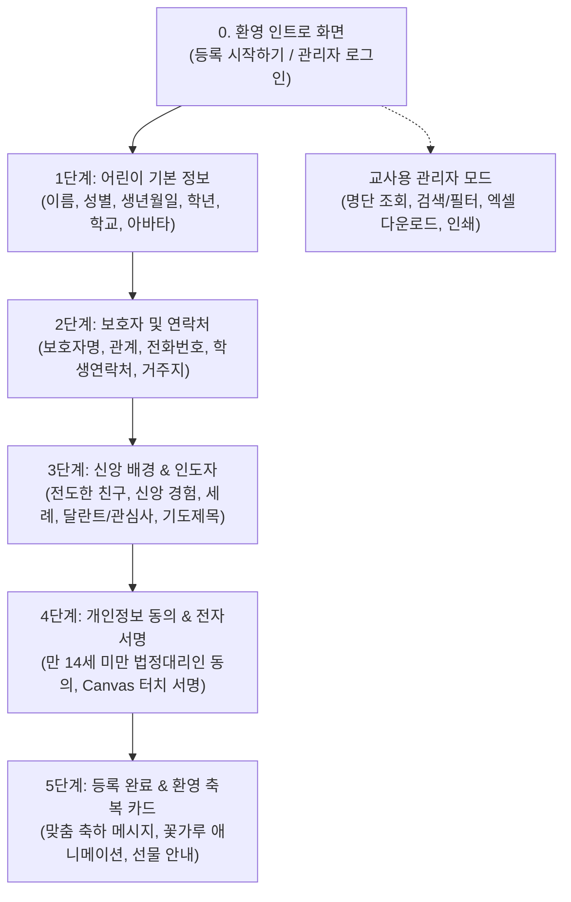

# 📋 [기획 산출물] 초등부 교회학교 새신자 등록 시스템 기능 명세서

## 1. 서비스 개요
- **서비스명**: 초등부 꿈나무 새신자 등록카드 (Welcome Kids Church)
- **목적**: 종이로 작성하던 초등부 새신자 등록카드를 모바일 및 태블릿 기반의 터치 친화적 웹 애플리케이션으로 전환하여, 어린이와 학부모의 등록 편의성을 높이고 교사의 행정 업무(심방 및 출결 관리)를 효율화함.
- **주요 타겟 사용자**:
  1. **초등학생 (1~6학년)**: 직관적인 아이콘과 선택형 카드로 쉽게 정보 입력
  2. **학부모/보호자**: 모바일/태블릿에서 신속하게 보호자 정보 입력 및 개인정보 동의/서명
  3. **교회학교 교사 및 교역자**: 등록 즉시 명단 확인, 검색/필터링, 엑셀 다운로드 및 카드 인쇄

---

## 2. 화면 및 프로세스 흐름 (User Flow)

---

## 3. 세부 입력 데이터 필드 정의

### 1단계: 어린이 기본 정보
| 필드명 | 타입 | 필수 여부 | 유효성 검사 및 설명 |
| :--- | :--- | :---: | :--- |
| **이름** | Text | **필수** | 2~10자 한글/영문 |
| **성별** | Radio / Chip | **필수** | '남아(Boy)', '여아(Girl)' 원터치 선택 |
| **생년월일** | Date | **필수** | YYYY-MM-DD (나이 자동 계산) |
| **학년** | Chip Button | **필수** | 1학년 ~ 6학년 원터치 선택 버튼 |
| **학교명** | Text | 선택 | 예: 은혜초등학교 |
| **프로필 아바타** | Selector | 선택 | 귀여운 동물/어린이 캐릭터 아바타 6종 중 선택 또는 사진 촬영 |

### 2단계: 보호자 및 연락처 정보
| 필드명 | 타입 | 필수 여부 | 유효성 검사 및 설명 |
| :--- | :--- | :---: | :--- |
| **보호자 성명** | Text | **필수** | 학부모/보호자 이름 |
| **보호자 관계** | Select / Chip | **필수** | 부 / 모 / 조부모 / 기타 |
| **보호자 연락처** | Tel | **필수** | `010-XXXX-XXXX` 자동 하이픈 포맷팅 및 번호 유효성 검사 |
| **어린이 연락처** | Tel | 선택 | 학생 본인 전화번호 (없는 경우 '없음' 체크) |
| **거주 지역** | Text | 선택 | 거주 동/아파트명 (차량 운행 탑승 여부 확인) |
| **차량 운행 이용** | Radio | 선택 | 이용함 / 직접 등교 |

### 3단계: 신앙 배경 및 인도자 정보
| 필드명 | 타입 | 필수 여부 | 유효성 검사 및 설명 |
| :--- | :--- | :---: | :--- |
| **인도자 (전도자)** | Text | 선택 | 전도해 준 친구 또는 선생님 이름 / 스스로 방문 |
| **교회 출석 경험** | Radio | **필수** | 처음 교회에 옴 / 이전에 다닌 적 있음 |
| **세례 여부** | Radio | **필수** | 유아세례 / 입교 / 미세례 / 잘 모름 |
| **관심 분야 (달란트)** | Multi-select Chip | 선택 | 찬양, 악기, 율동/댄스, 미술/만들기, 방송/미디어, 운동, 성경 암송 |
| **기도제목 및 바라는 점** | Textarea | 선택 | 선생님께 전하고 싶은 말, 건강 특이사항(알레르기 등) |

### 4단계: 개인정보 수집·이용 동의 (법적 필수)
| 필드명 | 타입 | 필수 여부 | 유효성 검사 및 설명 |
| :--- | :--- | :---: | :--- |
| **만 14세 미만 동의** | Checkbox | **필수** | 개인정보 수집 및 이용 목적, 항목, 보유기간 명시 및 동의 |
| **법정대리인 서명** | Canvas | **필수** | 화면 터치/마우스로 직접 서명 (서명 데이터 Base64 저장) |

### 5단계: 등록 완료 화면
- **환영 메시지**: `[어린이 이름] 친구를 예수님의 사랑으로 환영하고 축복해요! 🎉`
- **축복 성경 구절**: `어린 아이들이 내게 오는 것을 용납하고 금하지 말라 하나님의 나라가 이런 자의 것이니라 (마가복음 10:14)`
- **안내 메시지**: 선생님께 등록 선물을 받아가세요!

---

## 4. 교사용 관리자 기능 요구사항
1. **보안 인증**: 기본 비밀번호(`1234`) 모달 인증
2. **명단 조회**: 등록일시, 이름, 성별, 학년, 보호자 연락처, 인도자, 서명 유무 등 그리드 테이블
3. **검색 및 필터**: 학년별 탭 필터링 및 이름/인도자 실시간 검색
4. **데이터 내보내기**: 한글 깨짐 없는 **UTF-8 with BOM CSV/XLSX 엑셀 다운로드**
5. **개별 카드 인쇄**: A4에 최적화된 등록 카드 인쇄(Print) 레이아웃 제공
6. **데이터 관리**: 샘플 데이터 채우기, 전체 삭제 및 로컬 스토리지(`localStorage`) 자동 백업
